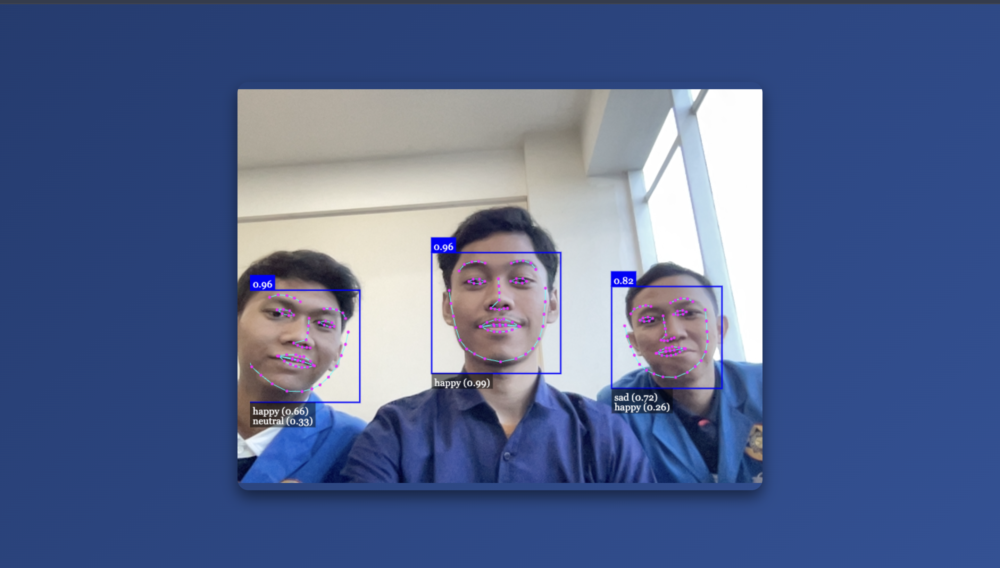

# Kelompok 6 : Deteksi Ekspresi Wajah

## Anggota Kelompok
- **Keimal Reyyan** : 221011401308
- **Imron Rosadi** : 221011402751
- **Sahrul Alfiansyah** : 221011400398

## Deskripsi Projek
Proyek ini bertujuan untuk membuat aplikasi web yang dapat mendeteksi ekspresi wajah secara realtime. Dengan menggunakan **face-api.js**, aplikasi ini dapat mendeteksi berbagai ekspresi wajah seperti senang, sedih, marah, terkejut, dan lain-lain melalui kamera perangkat pengguna. Aplikasi ini diharapkan dapat digunakan dalam berbagai skenario seperti penelitian, interaksi antarmuka, dan pengembangan teknologi berbasis AI.

## Demo
Cobalah demo aplikasi ini di [tautan berikut](https://deteksi-ekspresi.vercel.app/).

## Cara Menggunakan
1. Jalankan file HTML di browser favorit Anda.
   ```
   Buka file `index.html` di browser.
   ```
   usahakan menggunakan localhost / 127.0.0.0 atau menggunakan live server di vscode
2. Izinkan akses kamera pada prompt di browser.


## Teknologi yang Digunakan
- **Model**: Face-api.js
- **Library**:
  - `face-api.js`
  - `HTML5` dan `CSS3`
  - `JavaScript`
  
## Fitur Utama
- Deteksi wajah secara realtime menggunakan webcam.
- Identifikasi ekspresi wajah seperti senyum, marah, sedih, terkejut, dan lainnya.
- Visualisasi hasil deteksi dalam bentuk overlay pada video stream.
- Mendeteksi lebih dari 1 wajah secara simultan.


## Struktur Proyek
- `index.html`: Halaman utama untuk menampilkan video stream dan hasil deteksi.
- `script.js`: File JavaScript untuk menginisialisasi model dan melakukan deteksi.
- `face-api.min.js` : File Untuk Logika deteksi muka yang sudah disiapkan oleh face-api
- `models` : Folder untuk menyimpan model yang akan digunakan sebagai referensi deteksi ekspresi

## Penutup
Projek ini dibuat untuk tujuan memenuhi syarat dan tugas dari Mata Kuliah Kecerdasan dalam tugas UTS yang berkaitan dengan AI

## Hasil
<p align="center"></p>